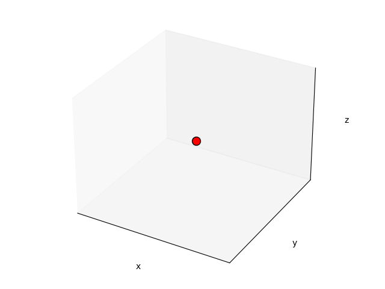

# Topology generation for UAV designs using Pacti

We demonstrate how pacti can be utilized to generate designs for Unmanned Aerial Vehicles (UAVs) under a set of predefined "design rules". Our primary objective is to produce a 3D grid, consisting of interconnected points that represent the abstract topology of the UAV. Each point within the grid represents a specific component of the UAV, such as fuselage, wing, rotor, etc., while each edge between two points depicts the connection among components. To achieve this, we employ a context-sensitive grammar (CSG) that formalizes the placement of UAV components on the grid based on their local context, i.e., the components around them.

Our grammar's primary goal is to generate all legal configurations of components and their connections within the 3D grid. A context-sensitive grammar (CSG) is a formal grammar that describes a formal language through a set of rules that define how strings of symbols within the language can be generated.

## Installation

Run `pdm install`

## Running

Run the `topologies.ipynb` or `run.py` to get started with this case study
